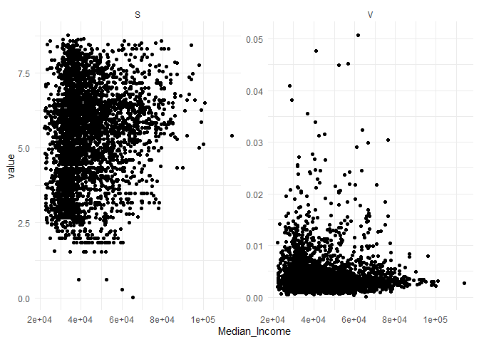
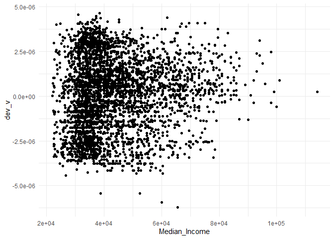

<!-- README.md is generated from README.Rmd. Please edit that file -->

``` r
knitr::opts_chunk$set(
  collapse = TRUE,
  comment = "#>"
)
```

# Sex health clinics in Toronto

<!-- badges: start -->
<!-- badges: end -->

This repository holds information about sex health clinics in Toronto.
It supports a student project for ENVSOCTY 4GA3 (Applied Spatial
Statistics) by:

- Victoria Baginski  
- Eva Boomsma  
- Peri Juskiw
- Samantha Kirtz  
- Chantelle Lobo  
- Helena Muirhead-Hunt  
- Eva Novoselac  
- Audreana Rossi

The students have collected information about clinics in Toronto, and
have the Dissemination Areas (DAs). They shared the DA centroids and the
location of the clinics. Additional information includes population by
various age groups. It would be nice to have income and other
demographic variables.

I obtained the road network in Toronto from
[BBBike](https://download.bbbike.org/osm/bbbike/Toronto), and use
{[r5r](https://ipeagit.github.io/r5r/index.html)} to calculate driving
times from DA centroids to each clinic.

The file with the road network is not shared on GitHub (it is a large
file), so if you wish to replicate the routing calculations you need to
obtain a copy and place in folder `data-raw/r5_graph/`. The file must be
in `osm.pbf` format, which is what {r5r} uses.

The notebook with the routing is in folder
`data-raw\01-OSM-Network-and-Routing`. You can check it for details.

The following data objects are available:

- `data/clinics.rda`: a simple features table with the location of the
  clinics.  
- `data/da_centroids.rda`: a simple features table with the centroids of
  the Dissemination Areas (DAs) in Toronto.
- `data/ttm_driva_da.rda`: a simple features table with Toronto’s
  Dissemination Areas (DAs) and population statistics by various age
  groups.  
- `data/ttm_driva_da.rda`: a data frame with driving times from DA
  centroid to clinic. The travel time is in minutes.

## Calculate accessibility and availability

Load packages:

``` r
library(accessibility) # Transport Accessibility Measures
library(dplyr) # A Grammar of Data Manipulation
#> 
#> Attaching package: 'dplyr'
#> The following objects are masked from 'package:stats':
#> 
#>     filter, lag
#> The following objects are masked from 'package:base':
#> 
#>     intersect, setdiff, setequal, union
library(ggplot2) # Create Elegant Data Visualisations Using the Grammar of Graphics
library(sf) # Simple Features for R
#> Linking to GEOS 3.11.2, GDAL 3.7.2, PROJ 9.3.0; sf_use_s2() is TRUE
library(tidyr) # Tidy Messy Data
```

Load data:

``` r
load("data/clinics.rda")
load("data/ttm_drive_da.rda")
load("data/toronto_das.rda")
```

Calculate the impedance, using a step-wise function:

``` r
# Calculate impedance; use the formula used by Paez, Higgins, and Vivona (2019). Check equation in page 27.
ttm_drive_da <- ttm_drive_da |>
  mutate(f_tt = case_when(travel_time <= 5 ~ 0.946,
                          travel_time > 5 & travel_time <= 10 ~ 0.801,
                          travel_time > 10 & travel_time <= 15 ~ 0.607,
                          travel_time > 15 & travel_time <= 20 ~ 0.411,
                          travel_time > 20 & travel_time <= 30 ~ 0.135,
                          travel_time > 30 & travel_time <= 45 ~ 0.011,
                          travel_time > 45 ~ 0.000))
```

The accessibility is the weighted sum of the clinics, with the weights
given by the impedance:

``` r
acc_sex <- ttm_drive_da |>
  group_by(DAUID) |>
  summarize(S = sum(f_tt),
            .groups = "drop")
```

Summary of the accessibility:

``` r
summary(acc_sex)
#>     DAUID                 S        
#>  Length:3741        Min.   :0.022  
#>  Class :character   1st Qu.:4.081  
#>  Mode  :character   Median :5.540  
#>                     Mean   :5.385  
#>                     3rd Qu.:6.606  
#>                     Max.   :8.772
```

Join the accessibility to the DAs:

``` r
toronto_das <- toronto_das |>
  left_join(acc_sex,
            by = "DAUID")
```

Plot the accessibility:

``` r
ggplot() +
  geom_sf(data = toronto_das,
          aes(fill = S),
          color = NA) +
  scale_fill_distiller(name = "Accessibility",
                       palette = "Reds", 
                       direction = 1,
                       na.value = "white") +
  labs(subtitle = "Accessibility to sex health clinics by DA") +
  theme_minimal()
```

<!-- -->

Prepare a table with the population and clinics to use as a land use
table in package {accessibility}:

``` r
# Prepare land use table
# Population
pop <- toronto_das |>
  st_drop_geometry() |>
  transmute(id = DAUID, 
            population = Pop15plus,
            clinics = 0)

# Clinics
opps <- clinics |>
  st_drop_geometry() |>
  transmute(id = id, 
            population = 0,
            clinics = 1)

# Bind into a single "land use" table
lu <- rbind(pop, opps)
```

Calculate the spatial availability of clinics (detailed table is the
portion of clinic allocated to each DA):

``` r
detailed_V <- spatial_availability(
  ttm_drive_da |>
    transmute(from_id = DAUID, 
              to_id = id,
              travel_time),
  lu |>
    mutate(population = replace_na(population, 0)),
  opportunity = "clinics",
  travel_cost = "travel_time",
  demand = "population",
  decay_function = decay_stepped(c(5, 10, 15, 20, 30, 45),
                                 weights = c(0.801, 0.607, 0.411, 0.135, 0.011, 0)),
  detailed_results = TRUE
)
```

Calculate the total spatial availability by DA (the sum of all portions
of clinics allocated to each DA):

``` r
V <- detailed_V |>
  group_by(from_id) |>
  summarize(V = sum(clinics),
            .groups = "drop") |>
  rename(DAUID = from_id)
```

Join spatial availability to DAs:

``` r
toronto_das <- toronto_das |>
  left_join(V,
            by = "DAUID")
```

Calculate the availability per capita $v_i$, this is the availability
divided by the population serviced in the DA:

``` r
toronto_das <- toronto_das |>
            mutate(v = V/Pop15plus)
```

Compare the accessibility and availability:

``` r
S_plot <- ggplot() +
  geom_sf(data = toronto_das,
          aes(fill = S),
          color = NA) +
  scale_fill_distiller(name = "Accessibility",
                       palette = "Reds", 
                       direction = 1,
                       na.value = "white") +
  labs(subtitle = "Accessibility to sex health clinics by DA") +
  theme_minimal()

V_plot <- ggplot() +
  geom_sf(data = toronto_das,
          aes(fill = V),
          color = NA) +
  scale_fill_distiller(name = "Availability",
                       palette = "Reds", 
                       direction = 1,
                       na.value = "white") +
  labs(subtitle = "Availability of sex health clinics by DA") +
  theme_minimal()

S_plot
```

<!-- -->

``` r
V_plot
```

<!-- -->

Plot the availability per capita:

``` r
ggplot() +
  geom_sf(data = toronto_das,
          aes(fill = v),
          color = NA) +
  scale_fill_distiller(name = "Availability per capita",
                       palette = "Reds", 
                       direction = 1,
                       na.value = "white") +
  labs(subtitle = "Availability per capita to sex health clinics by DA") +
  theme_minimal()
```

<!-- -->

Plot the deviations of the availability per capita relative to the
equality line (the number of clinics divided by the total population
serviced):

``` r
# Equal proportion is clinics divided by population
ep <- 15/sum(toronto_das$Pop15plus, na.rm = TRUE)
toronto_das <- toronto_das |>
  mutate(dev_v = v - ep)

# Plot deviations from equal distribution
ggplot() +
  geom_sf(data = toronto_das,
          aes(fill = dev_v),
          color = NA) +
  scale_fill_gradient2(name = "Availability per capita",
                       #palette = "Reds", 
                       #direction = 1,
                       na.value = "white") +
  labs(subtitle = "Availability per capita to sex health clinics by DA") +
  theme_minimal()
```

<!-- -->

``` r
toronto_das |>
  st_drop_geometry() |>
  select(Median_Income,
         S,
         V) |>
  pivot_longer(-Median_Income,
               names_to = "score",
               values_to = "value") |>
  ggplot(data = ) +
  geom_point(aes(x = Median_Income,
                 y = value)) +
  theme_minimal() +
  facet_wrap(~ score, scales = "free_y")
#> Warning: Removed 140 rows containing missing values or values outside the scale range
#> (`geom_point()`).
```

<!-- -->

``` r
cor(toronto_das$Median_Income, 
    toronto_das$S, 
    use = "pairwise.complete.obs")
#> [1] 0.1660929

cor(toronto_das$Median_Income, 
    toronto_das$V, 
    use = "pairwise.complete.obs")
#> [1] -0.009030069
```

``` r
toronto_das |>
  ggplot() +
  geom_point(aes(x = Median_Income,
                 y = dev_v)) +
  theme_minimal()
#> Warning: Removed 70 rows containing missing values or values outside the scale range
#> (`geom_point()`).
```

<!-- -->

``` r
cor(toronto_das$Median_Income, 
    toronto_das$dev_v, 
    use = "pairwise.complete.obs")
#> [1] 0.08570984
```

``` r
mod <- lm(dev_v ~ Median_Income + Low_Income + Average_Age + Prop_Visible_Minority + Prop_Indigenous_Pop + Prop_One_Parent_Families + Prop_Female,
   data = toronto_das |>
     st_drop_geometry() |>
     mutate(Median_Income = Median_Income/10000))

summary(mod)
#> 
#> Call:
#> lm(formula = dev_v ~ Median_Income + Low_Income + Average_Age + 
#>     Prop_Visible_Minority + Prop_Indigenous_Pop + Prop_One_Parent_Families + 
#>     Prop_Female, data = mutate(st_drop_geometry(toronto_das), 
#>     Median_Income = Median_Income/10000))
#> 
#> Residuals:
#>        Min         1Q     Median         3Q        Max 
#> -6.747e-06 -1.488e-06  3.950e-08  1.494e-06  4.668e-06 
#> 
#> Coefficients:
#>                            Estimate Std. Error t value Pr(>|t|)    
#> (Intercept)              -1.851e-06  6.819e-07  -2.715 0.006660 ** 
#> Median_Income             1.624e-07  3.427e-08   4.738 2.24e-06 ***
#> Low_Income                8.619e-09  5.092e-09   1.693 0.090612 .  
#> Average_Age              -2.888e-08  7.848e-09  -3.681 0.000236 ***
#> Prop_Visible_Minority    -1.157e-05  1.242e-05  -0.932 0.351573    
#> Prop_Indigenous_Pop       1.143e-05  1.243e-05   0.920 0.357777    
#> Prop_One_Parent_Families  1.802e-07  5.537e-07   0.325 0.744898    
#> Prop_Female               4.760e-06  1.146e-06   4.154 3.34e-05 ***
#> ---
#> Signif. codes:  0 '***' 0.001 '**' 0.01 '*' 0.05 '.' 0.1 ' ' 1
#> 
#> Residual standard error: 2.003e-06 on 3652 degrees of freedom
#>   (83 observations deleted due to missingness)
#> Multiple R-squared:  0.01803,    Adjusted R-squared:  0.01615 
#> F-statistic: 9.579 on 7 and 3652 DF,  p-value: 7.544e-12
```

``` r
mod <- lm(dev_v ~ Median_Income + Low_Income + Average_Age + Prop_Female,
   data = toronto_das |>
     st_drop_geometry() |>
     mutate(dev_v = dev_v/ep,
            Median_Income = Median_Income/10000))

summary(mod)
#> 
#> Call:
#> lm(formula = dev_v ~ Median_Income + Low_Income + Average_Age + 
#>     Prop_Female, data = mutate(st_drop_geometry(toronto_das), 
#>     dev_v = dev_v/ep, Median_Income = Median_Income/10000))
#> 
#> Residuals:
#>      Min       1Q   Median       3Q      Max 
#> -1.08393 -0.23914  0.00548  0.23910  0.74983 
#> 
#> Coefficients:
#>                 Estimate Std. Error t value Pr(>|t|)    
#> (Intercept)   -0.3163076  0.0900462  -3.513 0.000449 ***
#> Median_Income  0.0249514  0.0045171   5.524 3.55e-08 ***
#> Low_Income     0.0013613  0.0008022   1.697 0.089795 .  
#> Average_Age   -0.0047416  0.0011498  -4.124 3.81e-05 ***
#> Prop_Female    0.7844405  0.1718706   4.564 5.18e-06 ***
#> ---
#> Signif. codes:  0 '***' 0.001 '**' 0.01 '*' 0.05 '.' 0.1 ' ' 1
#> 
#> Residual standard error: 0.3218 on 3655 degrees of freedom
#>   (83 observations deleted due to missingness)
#> Multiple R-squared:  0.01772,    Adjusted R-squared:  0.01664 
#> F-statistic: 16.48 on 4 and 3655 DF,  p-value: 2.163e-13
```
